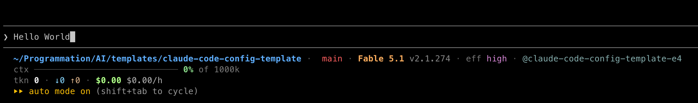

# claude-code-power-config

A complete, opinionated **[Claude Code](https://code.claude.com/docs)** configuration — rules,
skills, subagents, and deterministic hooks, wired together and documented end to
end. The framework and the worktree-first workflow are **language-agnostic**; only the included
conventions and scaffolding are stack-specific, and you swap those for your own.

It is refined through heavy daily use and demonstrated on a fictional **TypeScript monorepo**
(**"Acme"**, a real-time messaging platform), so every piece is readable in context. Working in
Python, Go, Rust, or a single-package repo? Keep the structure, the hooks, and the workflow;
replace the TypeScript conventions with yours.



<sub>The bundled <a href=".claude/statusline.sh"><code>statusline.sh</code></a>: directory, branch, model, a context-usage bar, token counts, and live session cost.</sub>

> **TL;DR** — Copy `.claude/` into your repo, adapt `AGENTS.md` and `.claude/rules/` to your
> stack, make the hooks executable, and you have path-scoped conventions, a quality gate on
> every turn, a multi-agent PR review, and a worktree-first workflow that never lets an agent
> commit to `main`.

---

## What's inside

| Layer | Count | What it does |
| :---- | :---- | :----------- |
| **`AGENTS.md`** + **`CLAUDE.md`** | 2 | Always-on project memory, layered: `AGENTS.md` is the tool-agnostic base (role, conventions map, comments/altitude discipline, git workflow) any coding agent can read; `CLAUDE.md` just imports it and adds Claude Code-only notes. Kept tiny on purpose. |
| **`rules/`** | 5 | Path-scoped **pure loaders** (one area each: core, backend, frontend, services, testing) that auto-load `docs/conventions/*.md` only when you touch matching files. |
| **`skills/`** | 30 | Auto-discoverable workflows: scaffolding (`new-api-endpoint`, `new-provider`…), engineering (`tdd`, `diagnose`, `resolve-merge-conflicts`, `find-dead-code`…), thinking & design (`grilling`, `grill-me`, `codebase-design`, `domain-modeling`, `prototype`…), PR & review (`pr-description`, `pr-ci-review`, `address-review-comments`, `review-retro`), meta (`write-a-skill`, `handoff`, `caveman`), and personal integrations (`obsidian-vault`, `daily-note`, `to-issues`, `fix-sonar`, `wiz`… — configured via `.env`). |
| **`agents/`** | 12 | Isolated subagents: 4 proactive (`convention-checker`, `migration-reviewer`, `security-reviewer`, `architecture-explainer`), 7 `review-*` reviewers + validator dispatched by `pr-ci-review`, and `comment-pruner` dispatched by its Stop hook. |
| **`hooks/`** | 7 | Zero-LLM shell scripts on lifecycle events: quality gate, convention spot-check, comment-pruner dispatch, git safety, generated-file protection, file-naming validation, compaction preservation. |

The full architecture — what loads when, the context budget, and how to extend each layer — is
documented in **[`.claude/README.md`](.claude/README.md)**. For when and how to use each skill,
see the **[skill catalog](.claude/skills/README.md)**.

```
┌──────────────────────────────────────────────┐
│  Always-On     AGENTS.md (via CLAUDE.md)       │
│                · skill descriptions            │
│  On-Demand     path-scoped rules · skill bodies│
│  Isolated      subagents (own context window)  │
│  External      hooks (deterministic, 0 tokens) │
└──────────────────────────────────────────────┘
```

## The worktree-first workflow

The spine of this setup: **never work on `main`, one git worktree per task.** The `git-safety`
hook blocks `checkout -b`/pushes on `main`, `pnpm worktree:create <name>` spins up an isolated
checkout under `.worktrees/`, the quality hook gates every response, and subagents can run in
their own worktree. Read the full loop in **[`docs/workflow.md`](docs/workflow.md)**.

## Quickstart

1. **Copy the config into your repo.**
   ```bash
   git clone https://github.com/AlexisBalayre/claude-code-power-config.git
   cp -R claude-code-power-config/.claude your-repo/.claude
   cp claude-code-power-config/AGENTS.md your-repo/AGENTS.md
   cp claude-code-power-config/CLAUDE.md your-repo/CLAUDE.md
   chmod +x your-repo/.claude/hooks/*.sh your-repo/.claude/statusline.sh
   ```
2. **Adapt it to your stack.** Edit `AGENTS.md` (role, conventions map, commands), point the `paths:` in
   `.claude/rules/*.md` at your directories, and replace the placeholder `lint`/`typecheck`/
   `test` scripts in `package.json` with your real toolchain.
3. **Opt into your tools.** Copy `.claude/settings.local.json.example` to
   `.claude/settings.local.json` (gitignored) and add your personal permissions / MCP servers.
4. **Personalize.** Copy `.env.example` to `.env` (gitignored) and fill in the values used by
   the personal-workflow skills and the worktree scripts: your Obsidian vault path, issue-tracker
   IDs, and (optionally) a non-default git trunk or branch prefix.

The hooks no-op until you touch matching files, so nothing breaks before you've wired your
toolchain.

## The demo project ("Acme")

So the rules, skills, and agents have something concrete to point at, the repo is modeled on a
fictional messaging platform. The shape maps cleanly onto most TypeScript monorepos:

| Path | Role |
| :--- | :--- |
| `apps/acme-api` | Public HTTP API (Hono + Zod OpenAPI) |
| `apps/acme-web` | React SPA (React 19, Vite, Tailwind v4, react-router-dom v7, TanStack Query) |
| `services/acme-gateway` | Realtime edge: connections, auth, routing (gRPC) |
| `services/acme-session-engine` | Stateful session lifecycle + state machines |
| `packages/acme-db` | Drizzle ORM schema + migrations |
| `packages/acme-providers` | Pluggable delivery providers (email, SMS, push, webhook) |
| `packages/acme-rpc` | Protobuf definitions + generated gRPC stubs |
| `packages/acme-domain` | Shared domain types (branded IDs, enums) |
| `packages/acme-logger` | Structured logger (no PII in logs) |

The conventions for each area live in [`docs/conventions/`](docs/conventions/) — five
consolidated docs (core, backend, frontend, services, testing) that are the single source of
truth the thin `rules/` loaders import. The [glossary](docs/glossary.md) anchors the shared
vocabulary.

## Repository structure

```
.
├── AGENTS.md                  # tool-agnostic always-on memory (any coding agent)
├── CLAUDE.md                  # thin Claude Code layer: @AGENTS.md + Claude-only notes
├── .env.example               # personalization hub (vault path, tracker IDs, git trunk)
├── package.json               # worktree scripts + toolchain hooks
├── scripts/
│   ├── worktree-create.sh     # pnpm worktree:create <name>
│   ├── worktree-clean.sh      # pnpm worktree:clean
│   └── pre-commit             # quality gate for human/CLI commits
├── .claude/
│   ├── README.md              # architecture deep-dive (start here)
│   ├── settings.json          # permissions + hook wiring
│   ├── settings.local.json.example
│   ├── statusline.sh
│   ├── rules/  skills/  agents/  hooks/
└── docs/
    ├── README.md              # Diátaxis index
    ├── glossary.md            # shared vocabulary
    ├── workflow.md            # the worktree-first loop
    ├── conventions/           # source of truth imported by rules/ (5 area docs)
    ├── reference/  explanation/  adr/
```

## Make it yours

- **Different stack?** The *patterns* transfer even if the libraries don't. Keep the layered
  structure (always-on vs. path-scoped vs. isolated vs. deterministic) and swap the content.
- **Don't want a rule/skill/agent?** Delete the file. Each piece is independent.
- **Add your own?** [`.claude/README.md`](.claude/README.md) has an "Adding new extensions"
  recipe for every layer, and the `write-a-skill` skill scaffolds new skills.

## Acknowledgments & sources

This config stands on ideas and patterns from:

- **[mattpocock/skills](https://github.com/mattpocock/skills)** — Matt Pocock's library of Claude Code skills and the progressive-disclosure approach to skill design.
- **[shanraisshan/claude-code-best-practice](https://github.com/shanraisshan/claude-code-best-practice)** — a practical catalog of Claude Code best practices.
- **[Claude Code documentation](https://code.claude.com/docs)** — the official reference for settings, hooks, skills, subagents, and slash commands.

## License

[MIT](LICENSE).
